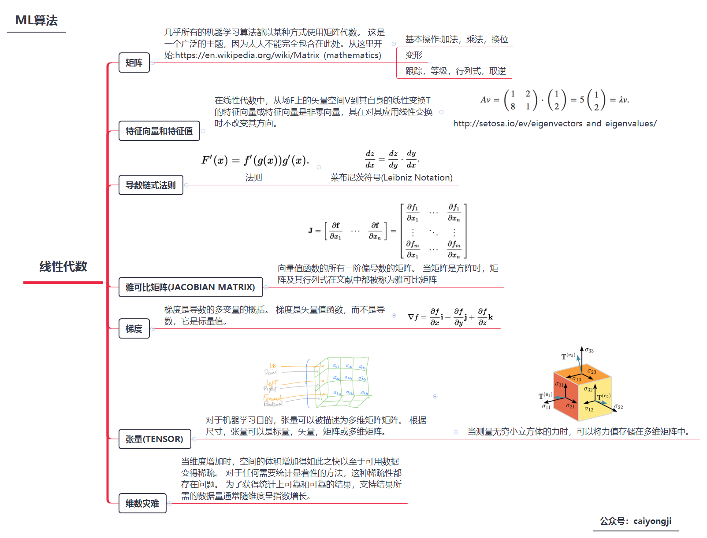
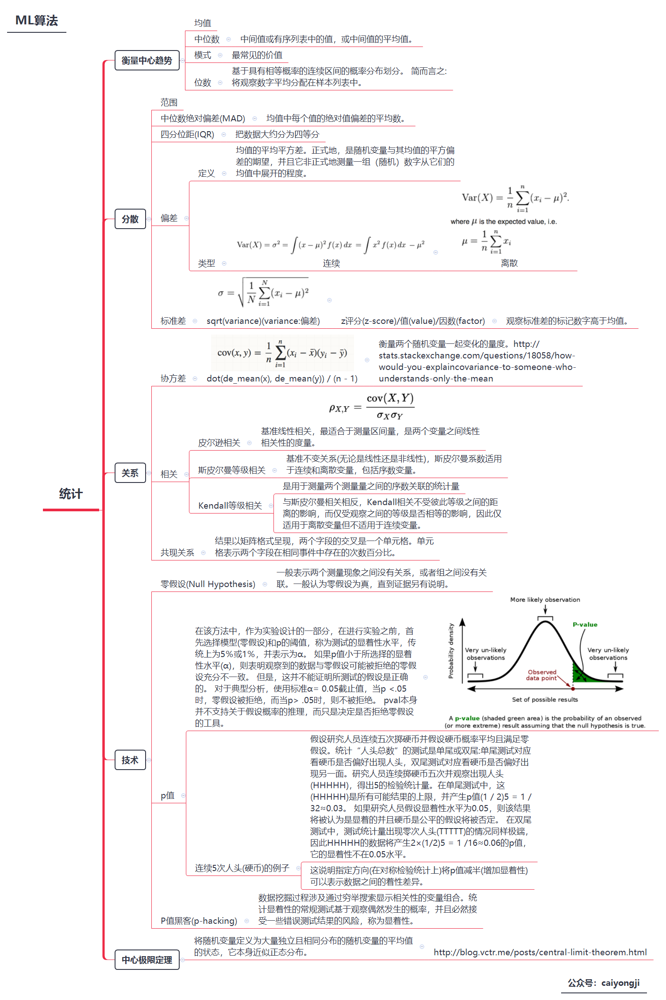
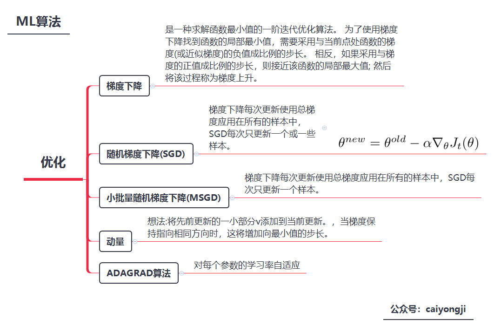
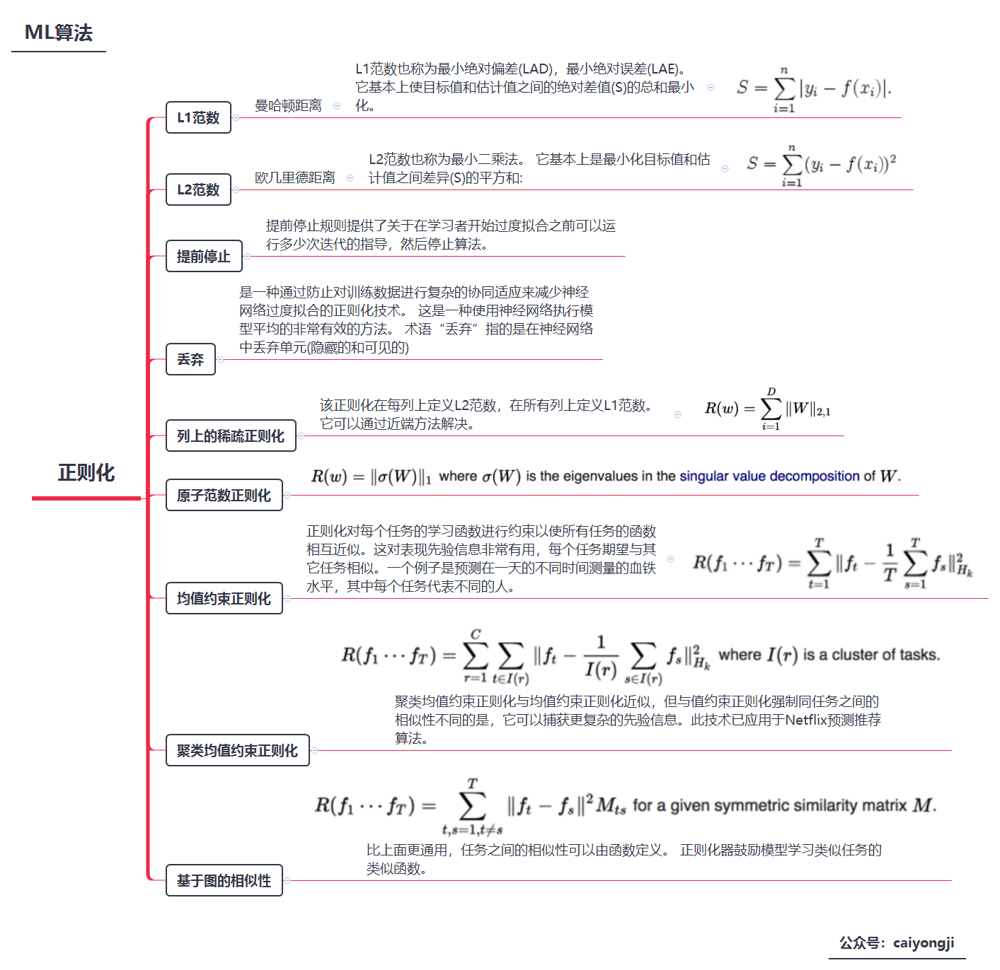
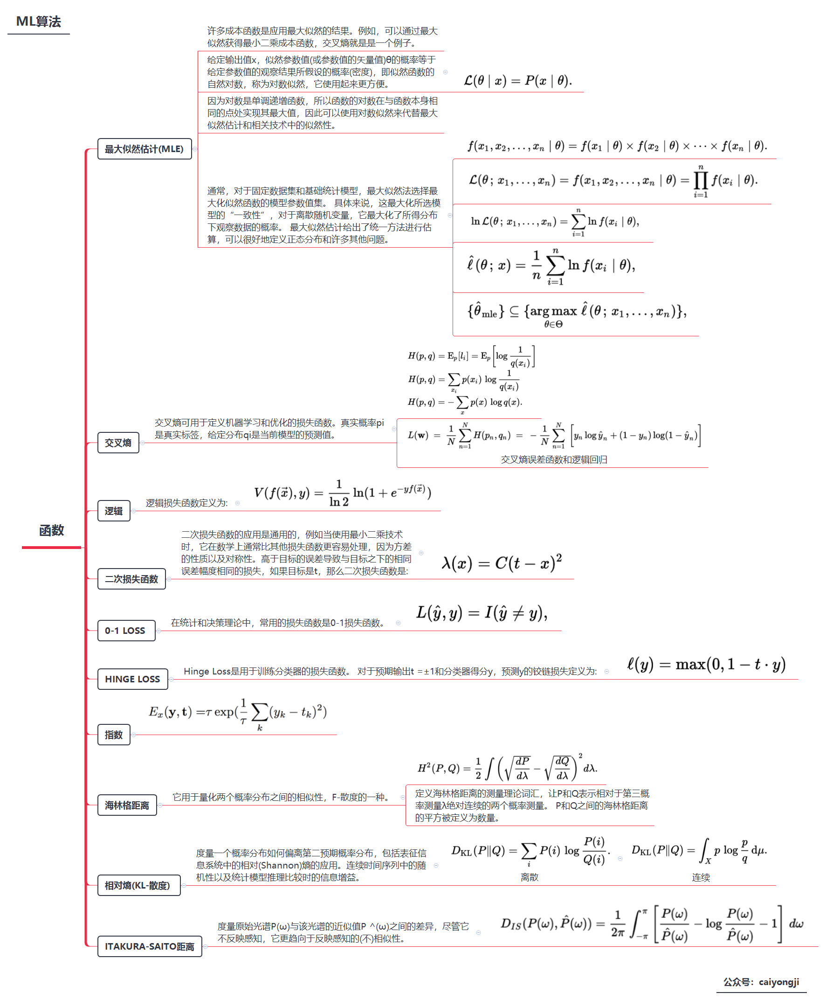
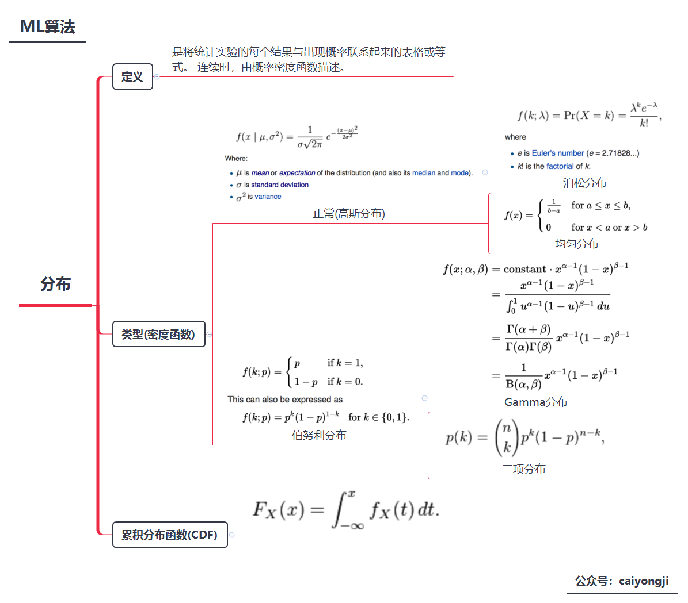
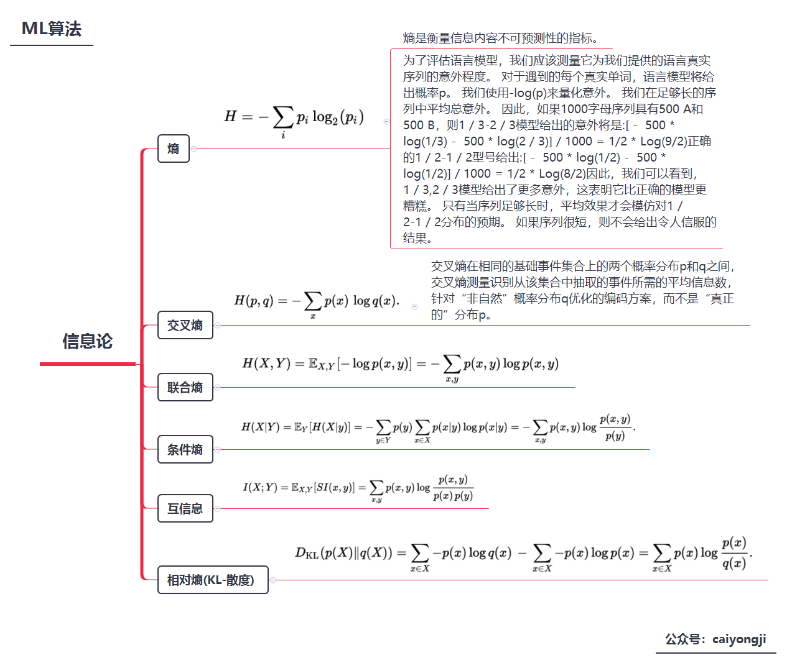

# machine-learning-mindmap-cn

机器学习导图系列教程旨在帮助引导开发者对机器学习知识网络有一个系统的概念，其中有些具体释义并未完善，需要开发者自己探索才能对具体知识有深入的掌握。本项目灵感来自[Daniel Formoso](https://github.com/dformoso/machine-learning-mindmap)的github开源项目。本文作者对其项目进行翻译、整理、批注等二次创作，其中不乏生僻的数学名词，对于没有留过学的作者来说费了很多功夫。我又将导图整理成了知识卡片，方便大家查看。由于机器学习的知识网络很大，导致完整的导图过大，文章中的图片可能经过压缩，如需完整图片可查看github项目**machine-learning-mindmap-cn**下载高清原图。本系列还在持续创作中，你的点赞、留言、star都会成为我持续创作的动力。  
如有发现翻译纰漏或更好的建议，欢迎与caiyongji联系。

> TIPS: 图片略大，请耐心等待或直接下载。

## 最近更新：2019/04/06

目录
-----------------

- [机器学习-数据处理](#机器学习-数据处理)
  - [数据类型](#数据类型)
  - [数据探索](#数据探索)
  - [数据清洗](#数据清洗)
  - [特征插补](#特征插补)
  - [特征工程](#特征工程)
  - [特征选择](#特征选择)
  - [特征编码](#特征编码)
  - [特征归一化或缩放](#特征归一化或缩放)
  - [构造数据集](#构造数据集)
- [机器学习-概念](#机器学习-概念)
  - [动机](#动机)
  - [性能分析](#性能分析)
  - [调参](#调参)
  - [类型](#类型)
  - [种类](#种类)
  - [分类](#分类)
  - [学习方法](#学习方法)
  - [分类学](#分类学)
  - [选择标准](#选择标准)
  - [库](#库)
- [机器学习-过程](#机器学习-过程)
  - [问题](#问题)
  - [方向](#方向)
  - [数据](#数据)
  - [模型-成本函数-优化-调参-结果和基准-扩展](#模型-成本函数-优化-调参-结果和基准-扩展)
  - [部署和运营-基础架构](#部署和运营-基础架构)
- [机器学习-算法](#机器学习-算法)
  - [线性代数](#线性代数)
  - [统计](#统计)
  - [优化](#优化)
  - [正则化](#正则化)
  - [函数](#函数)
  - [概率](#概率)
  - [分布](#分布)
  - [信息论](#信息论)
  - [密度估计](#密度估计)
- [机器学习模型及神经网络模型](#机器学习模型及神经网络模型)

### 关注公众号查看mindmap文本翻译、注释、说明及引用 ###

# 机器学习-数据处理

## 数据类型

## 数据探索

## 数据清洗

## 特征插补

## 特征工程

## 特征选择

## 特征编码

## 特征归一化(Normalisation)或缩放(Scaling)
或缩放(Scaling).png)
## 构造数据集

# 机器学习-概念

## 动机

## 性能分析

## 调参

## 类型

## 种类

## 分类

## 学习方法

## 分类学
.png)

## 选择标准

## 库

# 机器学习-过程

## 问题

## 方向

## 数据

## 模型-成本函数-优化-调参-结果和基准-扩展

## 部署和运营-基础架构

# 机器学习-算法

## 线性代数

## 统计

## 优化

## 正则化

## 函数

## 概率

## 分布

## 信息论

## 密度估计

# 机器学习模型及神经网络模型

